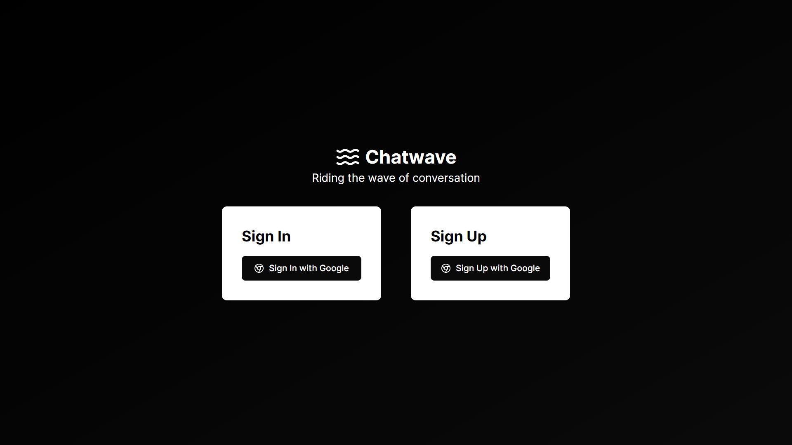

# Real-Time Chat Application

This is a real-time chat application built using Next.js, TypeScript, NextAuth.js, Pusher, Redis, and Axios. The application supports Google Sign-In/Sign-Up for authentication and provides real-time messaging capabilities.



## Features

- **Authentication**: Secure authentication using NextAuth.js with Google Sign-In/Sign-Up.
- **Real-Time Communication**: Real-time messaging powered by Pusher.
- **Type Safety**: Ensured with TypeScript.
- **High Performance**: Leveraging Redis for efficient data storage and retrieval.
- **Data Fetching**: Smooth and efficient using Axios.

## Tech Stack

- **Next.js**: Front-end framework.
- **TypeScript**: Type safety and robust type-checking.
- **NextAuth.js**: Authentication.
- **Pusher**: Real-time communication.
- **Redis**: Database.
- **Axios**: Data fetching.

## Installation

1. **Clone the repository:**

   ```bash
   git clone https://github.com/Prateekbh111/Chatwave-2.0.git
   cd chat-app
   ```

2. **Install dependencies:**

   ```bash
   npm install
   ```

3. **Environment Variables:**
   Create a `.env.local` file in the root directory and add the following environment variables:

   ```plaintext
   NEXTAUTH_URL=http://localhost:3000
   GOOGLE_CLIENT_ID=your_google_client_id
   GOOGLE_CLIENT_SECRET=your_google_client_secret
   REDIS_URL=redis://localhost:6379
   PUSHER_APP_ID=your_pusher_app_id
   PUSHER_KEY=your_pusher_key
   PUSHER_SECRET=your_pusher_secret
   PUSHER_CLUSTER=your_pusher_cluster
   ```

4. **Run the development server:**

   ```bash
   npm run dev
   ```

5. **Open your browser:**
   Navigate to `http://localhost:3000`.

## Usage

1. **Sign Up / Sign In:**
   Use Google Sign-In to authenticate.

2. **Start Chatting:**
   Enter a chat room and start sending messages in real-time.
